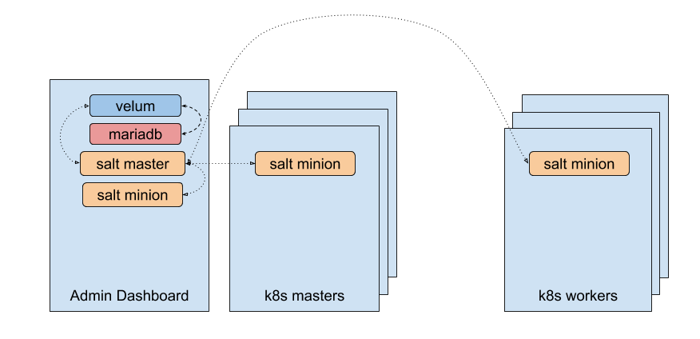
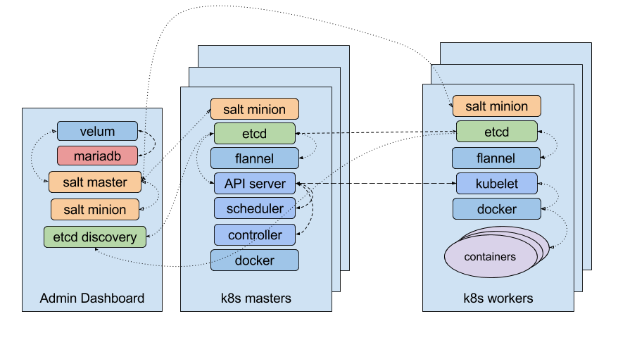

# Description

A collection of Salt states used to provision a kubernetes cluster
in the context of CaaSP/MicroOS.

# Salt states and CaaSP architecture

The Salt state creates an architecture that depends on some (already existing) elements. This is the expected setup before running the orchestration:

The _salt master_ is installed in the _Admin Dashboard_ and is reponsible for
orchestrating the deployment and controlling all the minions in the cluster,
including a local minion that is used for generating the CA certificate.

An _etcd_ instance is also used for bootstrapping the other etcd instances in
the cluster. It will be configured from Salt with the number of etcd masters
set in the pillar.

After running the orchestration, the architecture will look like this:

Some notes:

* the _etcd discovery_ server is **not** a member of the etcd cluster: it is
  only used as a _rendezvous_ for bootstrapping the etcd cluster.
* for the systems that need to talk to _etcd_, they connect to the local _etcd_
  instance. This local server will be either a full member of the _etcd_
  cluster or an instance that works in `rw`-proxy mode.

# License

This project is licensed under the Apache License, Version 2.0. See
[LICENSE](https://github.com/kubic-project/salt/blob/master/LICENSE) for the full
license text.
Test 4
